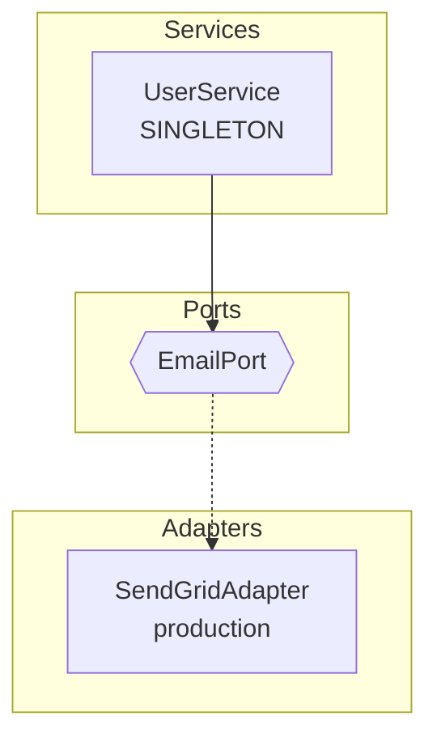

# Debugging Dependency Wiring

When your container does not resolve a type the way you expect, dioxide provides
three introspection methods to help you understand what is happening. Each method
answers a different question:

| Method | Question it answers | When to use |
|--------|-------------------|-------------|
| `debug()` | "What is registered in my container?" | Missing adapters, unexpected registrations, profile mismatches |
| `explain(cls)` | "How will this type be resolved?" | Wrong adapter selected, dependency chain issues, scope questions |
| `graph()` | "What does my architecture look like?" | Visualizing the full dependency graph, documentation, code reviews |

## debug() -- Registration Summary

`debug()` prints a summary of everything registered in the container: services,
adapters grouped by port, active profile, scope, and lifecycle indicators.

### Basic Usage

```python
from dioxide import Container, Profile

container = Container(profile=Profile.PRODUCTION)
print(container.debug())
```

Output:

```text
=== dioxide Container Debug ===
Active Profile: production

Services (2):
  - NotificationService (SINGLETON)
  - UserService (SINGLETON)

Adapters by Port:
  EmailPort:
    - SendGridAdapter (profiles: production)
  DatabasePort:
    - PostgresAdapter (profiles: production, lifecycle)
```

### Writing debug Output to a File

Pass a file-like object to write the output to a file while also returning
the string:

```python
with open("container-debug.txt", "w") as f:
    container.debug(file=f)
```

### Debugging "Adapter Not Found"

When you get an `AdapterNotFoundError`, the most common cause is a profile
mismatch -- an adapter is registered for a different profile than the one
the container is using.

Use `debug()` to see all registered adapters and their profiles:

```python
from typing import Protocol
from dioxide import Container, Profile, adapter, service


class EmailPort(Protocol):
    async def send(self, to: str, subject: str, body: str) -> None: ...


@adapter.for_(EmailPort, profile=Profile.PRODUCTION)
class SendGridAdapter:
    async def send(self, to: str, subject: str, body: str) -> None:
        ...


@service
class NotificationService:
    def __init__(self, email: EmailPort):
        self.email = email


# Oops -- using TEST profile, but SendGridAdapter only matches PRODUCTION
container = Container(profile=Profile.TEST)
print(container.debug())
```

The output reveals the problem -- `SendGridAdapter` is registered for
`production` but the container is using the `test` profile:

```text
=== dioxide Container Debug ===
Active Profile: test

Services (1):
  - NotificationService (SINGLETON)

Adapters by Port:
  EmailPort:
    - SendGridAdapter (profiles: production)
```

The fix is either to register an adapter for `Profile.TEST` or to use
`Profile.PRODUCTION`:

```python
@adapter.for_(EmailPort, profile=Profile.TEST)
class FakeEmailAdapter:
    def __init__(self):
        self.sent_emails: list[dict[str, str]] = []

    async def send(self, to: str, subject: str, body: str) -> None:
        self.sent_emails.append({"to": to, "subject": subject, "body": body})
```

### Checking Lifecycle Components

Components decorated with `@lifecycle` show a `lifecycle` indicator in the
debug output. This helps verify that initialization and disposal will run
for the components that need it:

```text
Services (1):
  - DatabasePool (SINGLETON, lifecycle)

Adapters by Port:
  DatabasePort:
    - PostgresAdapter (profiles: production, lifecycle)
```

## explain(cls) -- Resolution Tree

`explain()` shows how a specific type will be resolved, including the full
dependency tree, which adapter implements each port, and the scope of each
component.

### Basic Usage

```python
from dioxide import Container, Profile

container = Container(profile=Profile.PRODUCTION)
print(container.explain(UserService))
```

Output:

```text
=== Resolution: UserService ===

UserService (SINGLETON)
    +-- db: DatabasePort
    |   DatabasePort
    |   |   +-- PostgresAdapter (SINGLETON, profile: production)
    |   |       +-- config: AppConfig
    |   |           AppConfig (SINGLETON)
    +-- email: EmailPort
        EmailPort
            +-- SendGridAdapter (SINGLETON, profile: production)
                +-- config: AppConfig
                    AppConfig (SINGLETON)
```

### Understanding Resolution for a Port

You can also explain a port (Protocol/ABC) to see which adapter will be
selected:

```python
print(container.explain(EmailPort))
```

Output:

```text
=== Resolution: EmailPort ===

EmailPort
    +-- SendGridAdapter (SINGLETON, profile: production)
```

### Diagnosing Wrong Adapter Selection

If the wrong adapter is being selected, `explain()` shows exactly which
adapter matches the active profile:

```python
# Container using PRODUCTION profile
container = Container(profile=Profile.PRODUCTION)
print(container.explain(EmailPort))
# Shows SendGridAdapter

# Container using TEST profile
container = Container(profile=Profile.TEST)
print(container.explain(EmailPort))
# Shows FakeEmailAdapter (or "no adapter for profile: test" if missing)
```

### Detecting Circular Dependencies

`explain()` detects circular references in the dependency tree and reports
them clearly:

```python
print(container.explain(SelfRefService))
```

Output:

```text
=== Resolution: SelfRefService ===

SelfRefService (SINGLETON)
    +-- other: SelfRefService
        SelfRefService (circular reference)
```

### Handling Unregistered Types

When a type is not registered at all, `explain()` provides a clear message:

```python
print(container.explain(SomeUnregisteredType))
```

Output:

```text
=== Resolution: SomeUnregisteredType ===

SomeUnregisteredType is not registered.
```

## graph() -- Architecture Visualization

`graph()` generates a visual representation of the entire dependency graph.
It supports two output formats: Mermaid (default) and Graphviz DOT.

### Mermaid Format (Default)

```python
from dioxide import Container, Profile

container = Container(profile=Profile.PRODUCTION)
print(container.graph())
```

Output:

````text
graph TD
    subgraph Services
        NotificationService["NotificationService<br/>SINGLETON"]
        UserService["UserService<br/>SINGLETON"]
    end

    subgraph Ports
        EmailPort{{EmailPort}}
    end

    subgraph Adapters
        SendGridAdapter["SendGridAdapter<br/>production"]
    end

    UserService --> EmailPort
    EmailPort -.-> SendGridAdapter
````

Paste this into any Mermaid renderer (GitHub markdown, Mermaid Live Editor,
VS Code extensions) to get an interactive diagram.

### Graphviz DOT Format

For publication-quality diagrams or CI pipelines that use Graphviz:

```python
print(container.graph(format="dot"))
```

Output:

```text
digraph Container {
    rankdir=TB;
    node [shape=box];

    subgraph cluster_services {
        label="Services";
        NotificationService [label="NotificationService\nSINGLETON"];
        UserService [label="UserService\nSINGLETON"];
    }

    subgraph cluster_ports {
        label="Ports";
        node [shape=diamond];
        EmailPort;
    }

    subgraph cluster_adapters {
        label="Adapters";
        SendGridAdapter [label="SendGridAdapter\nproduction"];
    }

    UserService -> EmailPort;
    EmailPort -> SendGridAdapter [style=dashed];
}
```

Render with Graphviz:

```bash
python -c "from dioxide import Container, Profile; c = Container(profile=Profile.PRODUCTION); print(c.graph(format='dot'))" | dot -Tpng -o deps.png
```

### Reading the Graph

The graph organizes components into three groups:

- **Services** (solid boxes): Core business logic decorated with `@service`
- **Ports** (diamond/hexagon shapes): Protocol or ABC interfaces
- **Adapters** (solid boxes with profile label): Implementations decorated with
  `@adapter.for_()`

Edge types:

- **Solid arrows** (`-->`) indicate constructor dependencies -- a service depends
  on a port
- **Dashed arrows** (`-.->`) indicate implementations -- an adapter implements
  a port

### CI Integration

Generate a dependency graph as part of your CI pipeline to keep architecture
documentation up to date automatically.

#### GitHub Actions Example

```yaml
name: Dependency Graph

on:
  push:
    branches: [main]

jobs:
  generate-graph:
    runs-on: ubuntu-latest
    steps:
      - uses: actions/checkout@v4

      - name: Set up Python
        uses: actions/setup-python@v5
        with:
          python-version: "3.12"

      - name: Install dependencies
        run: |
          pip install dioxide

      - name: Generate Mermaid graph
        run: |
          python -c "
          from dioxide import Container, Profile
          container = Container(profile=Profile.PRODUCTION)
          print(container.graph())
          " > docs/dependency-graph.mmd

      - name: Generate DOT graph
        run: |
          python -c "
          from dioxide import Container, Profile
          container = Container(profile=Profile.PRODUCTION)
          print(container.graph(format='dot'))
          " > docs/dependency-graph.dot

      - name: Render PNG (optional, requires graphviz)
        run: |
          sudo apt-get install -y graphviz
          dot -Tpng docs/dependency-graph.dot -o docs/dependency-graph.png

      - name: Commit updated graph
        run: |
          git config user.name "github-actions[bot]"
          git config user.email "github-actions[bot]@users.noreply.github.com"
          git add docs/dependency-graph.*
          git diff --staged --quiet || git commit -m "docs: update dependency graph"
          git push
```

#### Embedding in Documentation

Include the generated Mermaid graph directly in your README or documentation:

````markdown
## Architecture


````

## Combining Methods for Effective Debugging

Use the three methods together for a complete picture:

1. **Start with `debug()`** to see what is registered and catch missing adapters
   or profile mismatches
2. **Drill into `explain(cls)`** on the specific type that is failing to resolve,
   to see its full dependency chain
3. **Generate `graph()`** to understand the overall architecture and spot
   unexpected dependency patterns

### Debugging Workflow Example

```python
from dioxide import Container, Profile

container = Container(profile=Profile.PRODUCTION)

# Step 1: What's registered?
print(container.debug())
# Check: Are all expected adapters listed?
# Check: Do profiles match the active profile?

# Step 2: How will UserService resolve?
print(container.explain(UserService))
# Check: Are all dependencies satisfied?
# Check: Is the correct adapter selected for each port?

# Step 3: What does the full picture look like?
print(container.graph())
# Check: Are there unexpected dependencies?
# Check: Is the architecture clean (services depend on ports, not adapters)?
```

## Next Steps

- {doc}`/troubleshooting/index` -- Solutions for specific error messages
- {doc}`/guides/choosing-decorators` -- When to use `@service` vs `@adapter.for_()`
- {doc}`/user_guide/container_patterns` -- Container configuration patterns
